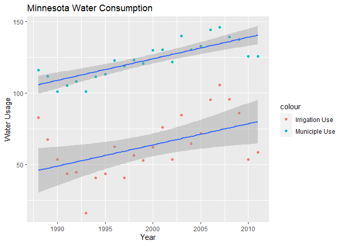
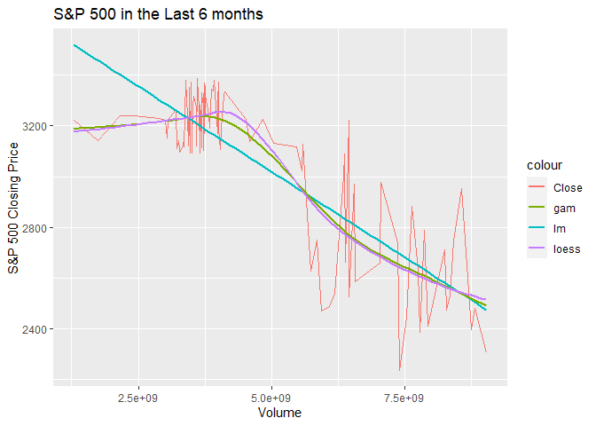

Showing off some ggplot2 skills
================
Benn Jesser
</br>11 4 2020

## Goal and requirements

The goal of this assignment is simple: I want you to produce *four*
different figures using **ggplot2**. They don’t have to be identify
causal relationships, or anything like that. I just want you to stretch
your visualization legs and demonstrate any new (or existing)
**ggplot2** skills that you have acquired since our first lecture.

Some additional points:

  - You are free to use any dataset that comes in-built with base R, or
    bundled together with an external R package. See
    [here](https://vincentarelbundock.github.io/Rdatasets/datasets.html)
    for an impressive list.

  - That being said, I would especially encourage you to use your own
    data.
    
      - I know we haven’t gotten to data importation yet, but take a
        look
        [here](https://support.rstudio.com/hc/en-us/articles/218611977-Importing-Data-with-RStudio)
        if you need help. I would recommend that you install the
        **readr**, **read\_excel** and **haven** packages first, though.
      - If your dataset isn’t proprietary (or isn’t being read directly
        off the web), please save it in the (empty) `data/` folder of
        this repo.

  - You can use the same dataset for all four of your plots. Or you can
    use a new dataset for each plot. Regardless of what you choose, I
    want you to try and use different geoms for each figure.

  - Any other **ggplot2** skills and add-ons like faceting, changing
    aesthetic scales or legends, using different themes (e.g. from the
    **ggthemes** package), animation, etc. are all welcome and
    encouraged.

  - I want to *see* the code that produces the figures. (Don’t use
    `echo=FALSE` in any of the code chunks, if that means anything to
    you.)

### What you will be graded on

  - Are your figures clear? (e.g. lack of chart chunk, non-overlapping
    labels)
  - Are your figures compelling? (e.g. use an appropriate geom for the
    insight that you want to convey)
  - Variation (I don’t want to see four line charts of the same dataset…
    Be creative)
  - Did you read and follow my instructions (e.g. describe your data and
    figures, show the code that produced the figures, include data in
    the `/data` folder, etc)
  - etc.

Lastly, don’t forget to knit the assignment (click the “Knit” button, or
press `Ctrl+Shift+K`) before submitting\!

## Start the assignment

Here is a R code chunk for you to load your packages. Feel free to load
as many other packages and insert as many additional code chunks
(`Ctr+Alt+I`) as you need. You can always load additional packages in
the their own chunk blocks, but I recommend loading all of your packages
together at the top.)

``` r
if (!require("pacman")) install.packages("pacman")
```

    ## Loading required package: pacman

``` r
## Note: The `p_load()` function from the pacman package is a convenient way to 
## install (if necessary) and load packages all at once. You can think of this
## as an alternative to the normal `library(ggplot2); library(here);...` way of
## loading R packages.
pacman::p_load(ggplot2, here)
```

### Figure 1: Title description

Load/read in the data. (Delete this chunk if you don’t need it.)

``` r
library(alr4)
```

    ## Loading required package: car

    ## Loading required package: carData

    ## Loading required package: effects

    ## Registered S3 methods overwritten by 'lme4':
    ##   method                          from
    ##   cooks.distance.influence.merMod car 
    ##   influence.merMod                car 
    ##   dfbeta.influence.merMod         car 
    ##   dfbetas.influence.merMod        car

    ## lattice theme set by effectsTheme()
    ## See ?effectsTheme for details.

``` r
cool_data <- alr4::MinnWater
```

This is a data set from my Math 463 class that displays water
consumption in Minnesota, from 1988 to 2011. I graphed water used for
agriculture and water used in municiple areas (not sure of the units :/
)

``` r
ggplot(cool_data)+geom_point(aes(x=year, y=muniUse,col= 'Municiple Use'))+geom_point(aes(x=year, y=irrUse,col='Irrigation Use'))+geom_smooth(aes(x=year, y=muniUse),method = 'lm')+geom_smooth(aes(x=year, y=irrUse),method = 'lm')+labs(x='Year',y='Water Usage',title = 'Minnesota Water Consumption')
```

    ## `geom_smooth()` using formula 'y ~ x'
    ## `geom_smooth()` using formula 'y ~ x'

<!-- --> This graph shows the
how much water is used for irrigation and municiple use in Minnesota. I
threw in a linear best fit line with standard error. Its interesting to
see how much more variance there is in the irrigation because of
weather, but it can also be seen in municiple use (watering lawns most
likely). Intersting topic with increased droughts and water crises
thanks to global warming, that often put farmers against municiple water
use.

### Figure 2: S\&P 500

``` r
setwd("~/assignment-01-ggplot2-team-09/data")
cooler_data<-read.csv(file = '^GSPC.csv')
```

``` r
library(scales)
ggplot(cooler_data)+geom_line(aes(x=Volume,y=Close,col='Close'))+geom_smooth(aes(x=Volume,y=Close,col='lm'),method ='lm',se=FALSE)+geom_smooth(aes(x=Volume,y=Close,col='gam'),method = 'gam',se=FALSE)+geom_smooth(aes(x=Volume,y=Close,col='loess'),method = 'loess',se=FALSE)+labs(y='S&P 500 Closing Price',title = 'S&P 500 in the Last 6 months')
```

    ## `geom_smooth()` using formula 'y ~ x'

    ## `geom_smooth()` using formula 'y ~ s(x, bs = "cs")'

    ## `geom_smooth()` using formula 'y ~ x'

<!-- --> This data is from Yahoo
Finance of the S\&P 500 Index from the last 6 months. I decided to look
at the closing price and trade volume. I graphed the data and then put
three regression lines on it. Its interesting to see how badly the
models fit the data at very high trading volumes. This makes sense since
high trade volume is synonymous with a volatile market. The effects of
COVID-19 are apparent in the fact that high trade volume has shown to be
correlated with a lower closing price (contraction/recession). I tried
for quite sometime to be able to use the time series data, but could not
figure out the scale\_x so the dates were obnoxious along the x axis.

### Figure 3: Title Description

``` r
# Plot code here
```

### Figure 4: Title description

``` r
# Plot code here
```
